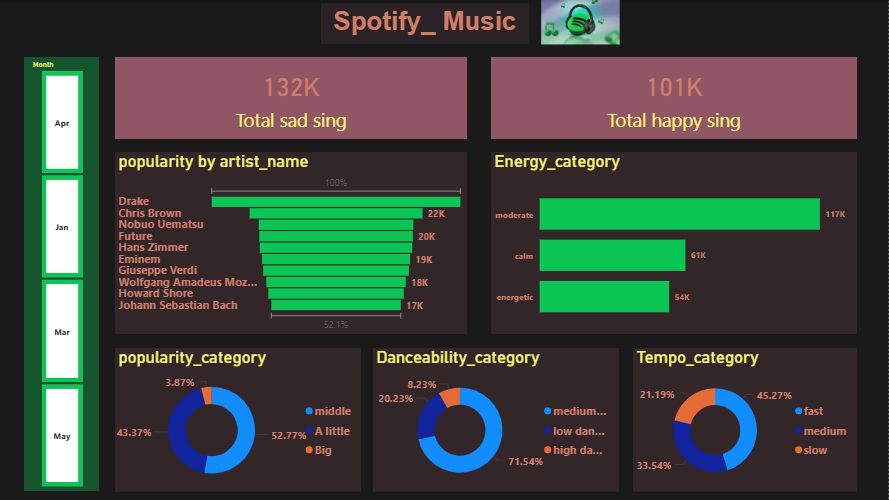
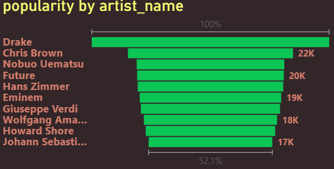
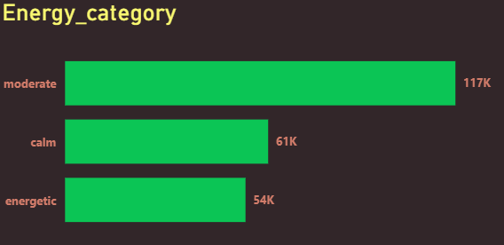
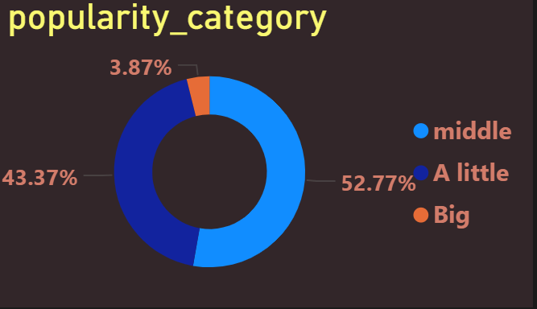
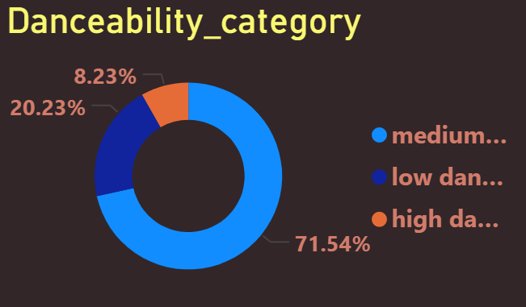
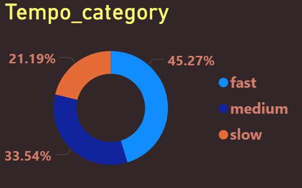

# Spotify_data_analysis
data analysis project using power bi to explore spotify platform
## Data source :
from kaggel 
## Tools used :
Power Bi
## Project Question : 
How do audio features and artist characteristics impact song popularity on spotify ??
## Explore data :
the data contains 232726 rows and 18 columns 
## Clean data :
1-unimportant columns were removed from the analysis 

2-removed errors 

3-removed duplicate data 

4-each column was converted to a number , data or text format depending on the column and its contents

5-prepared the dataset for analysis 
## data analysis :

                                                         Dashboard

Drake is the most popular artist , by a clear margin over the top 10

people prefer moderately energetic songs , neither too loud nor too calm

people tend to prefer songs that are not extrmely popular

people prefer songs with a moderate level of danceability

A good portion of listeners prefer fast and mid-tempo songs over slow ones

#As shown in the dashboard , the largest share of songs on the platform are sad 
